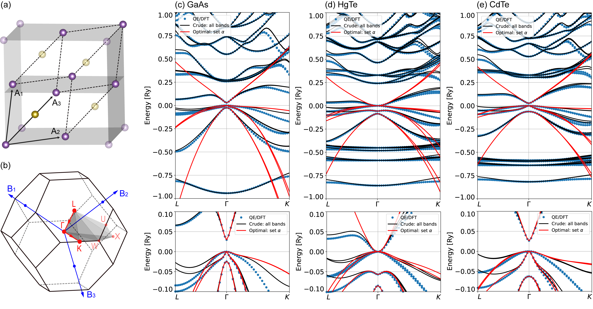
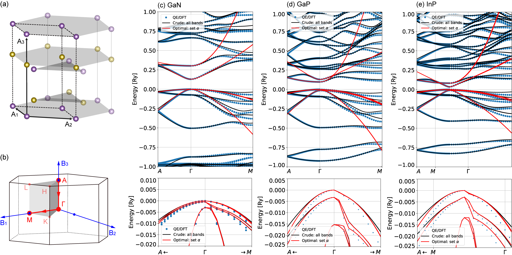
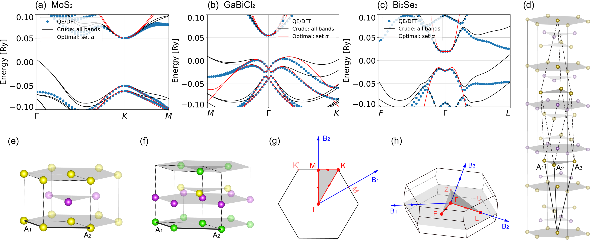

# DFT2kp Copyright (C) 2023  
## Article available in Arxiv: [DFT2kp: effective kp models from ab-initio data](https://arxiv.org/abs/2306.08554)

A numerical framework to explicitly calculate kp matrix elements from *ab-initio* data.

**Documentation** available at [dft2kp.gitlab.io/dft2kp](https://dft2kp.gitlab.io/dft2kp/)

## Current features

- Calculates kp matrix elements using the DFT eigenstates from [Quantum Espresso (QE)](https://gitlab.com/QEF/q-e).
- Folding down of the effective Hamiltonian into a set of selected bands.
- Rotates the numeriacal basis into a representation informed by the user.

## See also

- List of authors: [AUTHORS.md](https://gitlab.com/dft2kp/dft2kp/-/blob/main/AUTHORS.md)
- References to cite if we use our code: [CITING.md](https://gitlab.com/dft2kp/dft2kp/-/blob/main/CITING.md)
- Quick install intructions and compatibility requirements: [INSTALL.md](https://gitlab.com/dft2kp/dft2kp/-/blob/main/INSTALL.md)
- Quick install intructions and compatibility requirements: [INSTALL.md](https://github.com/Augusto-de-Lelis-Araujo/DFT2kp-effective-kp-models/blob/main/INSTALL.md)

------------------------------------------------------------------------

Figure 1) (a) Zincblende lattice, and (b) its first Brillouin zone (FCC). The band structure for (c) GaAs, (d) HgTe, and (e) CdTe are shown over a large energy scale on the main panels, while at the bottom of each panel we show a zoom over the relevant low energy range. In all cases the DFT data consider 1000 bands

------------------------------------------------------------------------

Figure 2) (a) Lattice and (b) Brillouin zone for wurtzite crystals. Band structures for (c) GaN, (d) GaP and (e) InP showing the large energy range on top, and a zoom showing the top of the valence bands at the bottom of each panel. In all cases, the DFT calculation considers 1000 bands.

------------------------------------------------------------------------

Figure 3) Band structures for: (a) MoS2, (b) GaBiCl2, and (c) Bi2Se3 showing only the relevant low energy range. The DFT calculations were performed for 1000, 500, 500 bands, respectively. (d) Rhombohedral lattice of Bi2Se3 and 2D hexagonal lattice of (e) MoS2 and (f) GaBiCl2, where we have omitted the vacuum region (15 Å) perpendicular to the plane formed by vectors A1 and A2. (g) 2D Brillouin zone common to MoS2 and GaBiCl2, and (h) 3D BZ of Bi2Se3.
