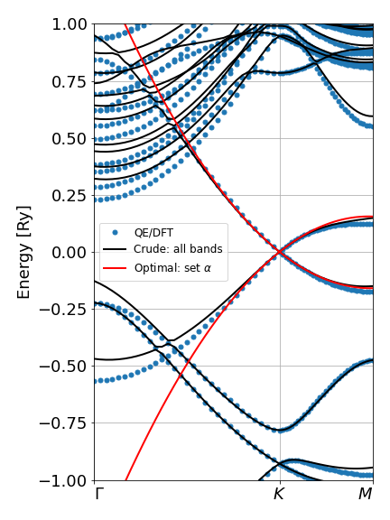

# Quickstart: graphene

Here we already assume that our python package is already installed and QE was patched and recompiled with our modifications. For more detail, plase check the instructions in the {doc}`Section Installation <installation>`.

The paper presenting the code introduces **graphene** as minimal example on how to run the code. Please read the paper for more detail. Here we use this same example to show a quick hands-on tutorial illustrating the main steps to run our code.

The full code is shown in the Examples folder of the gitlab repository. The final result is the Hamiltonian and its numerical parameters shown at the end of this page, which is used to generate the following band structure:



Above, the blue dots are the numerical QE data, the black lines are the results of our model considering all bands as the set {math}`\alpha`, while the red lines are taken from the minimal model below, which considers only the two bands of interest as set {math}`\alpha`.

## Run QE with our patch

For parallel execution, add the `mpirun` calls to the examples below.

First, run a self-consistent calculation as

```bash
pw.x -inp scf.in > scf.out 2> scf.err
```

The input file `scf.in` follows the common QE workflow. For instance, here we use:

```text
&CONTROL
    calculation='scf'
    prefix='graphene'
    restart_mode='from_scratch'
    outdir='./outdir'
    pseudo_dir='../../pseudos/ONCVPSP/abinit/'
/
&SYSTEM
    ibrav = 4, a = 2.460, c= 20,
    nat = 2, ntyp = 1,
    ecutwfc = 80.0 ,
    ecutrho = 800.0 ,
    nbnd = 300 ,
    occupations = 'smearing', degauss = 0.0001, smearing = 'marzari-vanderbilt',
    assume_isolated = '2D',
    noncolin = False,
    lspinorb = False,
/
&ELECTRONS
    conv_thr = 1.0d-8,
    mixing_beta = 0.3,
/
ATOMIC_SPECIES
C 12.0107 C_ONCV_PBE_sr.upf
ATOMIC_POSITIONS crystal
C   0.33333333 0.66666667 0.00000000
C   0.66666667 0.33333333 0.00000000
K_POINTS automatic
12 12 1 0 0 0
```

The next step is to run the `bands` calculation with `pw.x` calling

```bash
pw.x -inp nscf.in > nscf.out 2> nscf.err
```

The input file `nscf.in` is nearly identical to the one above. The only difference is to replace the K_POINTS section with a path over the Brillouin zone to plot the bands.

```text
...

K_POINTS crystal_b
3
+0.0000000000 0.000000000 0.000000000 30 ! G
+0.3333333333 0.333333333 0.000000000 30 ! K
+0.0000000000 0.500000000 0.000000000 30 ! M
```

Next, we run the patched version of `bands.x` to extract the bands and calculate the matrix elements. It can be run as

```bash
bands.x -inp bands.in > bands.out 2> bands.err
```

The input file `bands.in` reads as

```text
&bands
outdir = './outdir'
prefix = 'graphene'
filband = 'bands'
lsym = False
lp = True
lallp = True
filp = 'kp.dat'
firstk = 31
lastk = 31
/
```

Above, the `lp = True` flag instructs QE to call the routine that calculates the matrix elements, and `lallp = True` defines that this calculation should be done with our patched code, such that it calculates all matrix elements, and not only those between valence and conduction band eigenstates. The matrix elements are stored in the file indicated by `filp` and we recommend always using the name `kp.dat`. The last two itens `firstk = lastk = 31` indicates that the matrix elements should use the wave-functions from the 31st point in the path defined in `nscf.in`. For this example, that's the K point of graphene.

## Run the python code

The Examples folder in the gitlab repos show detailed codes on how to run and plot the data. Here we show only the minimal approach for graphene.

The minimal code read as

```python
import numpy as np
import pydft2kp as dft2kp

# import s0, sx, sy, sz: Pauli matrices
from pydft2kp.constants import s0, sx, sy, sz

# step 1: read DFT data
kp = dft2kp.irrep(dftdir='graphene-nosoc',
                  outdir='outdir',
                  prefix='graphene',
                  kpt=31,           
                  kname='K')

# step 2: read or calculate matrix elements of p
kp.get_p_matrices(qekp='kp.dat')

# step 3: define the set alpha
#         applies fold down via Löwdin
setA = [3, 4]
kp.define_set_A(setA)

# step 4: builds optimal model with qsymm
phi = 2*np.pi/3
U = np.diag([np.exp(1j*phi), np.exp(-1j*phi)])
C3 = dft2kp.rotation(1/3, [0,0,1], U=U)
My = dft2kp.mirror([0,1,0], U=sx)
Mz = dft2kp.mirror([0,0,1], U=-s0)
TI = dft2kp.PointGroupElement(R=-np.eye(3), 
                              conjugate=True, 
                              U=sx)
symms = [C3, My, Mz, TI]
qs = dft2kp.qsymm(symms, total_power=2, dim=3);

# step 5: calculate the representation matrices
kp.get_symm_matrices()
# (optional): adds anti-unitary symmetry
kp.add_antiunitary_symm(TI, np.array([0,0,0]))

# step 6: calculates and applies 
#         the transformation U
optimal = dft2kp.basis_transform(qs, kp)

# step 7: print results
optimal.print_report(sigdigits=3)
```

Above, **step 1** is to read the data, which we indicate to be stored in a folder named `graphene-nosoc`. This is the folder that holds the QE data obtained in the previous Section. The `outdir` and `prefix` follow from the QE input files above, and the `kpt=31` parameter indicates that we want to use the 31st point in the K_POINTS path. The k-point name `'K'` must match the nomenclature from the [IrRep package](https://github.com/stepan-tsirkin/irrep).

In **step 2** we indicate that the matrix elements are stored in the `qekp=kp.dat` file under the `graphene-nosoc` folder. If the `qekp` parameter is ommited (e.g. `kp.get_p_matrices()`) the code calculates the matrix elements in a rudimentary fashion, neglecting SOC contributions. This is not recommended, but it is an alternative for situations where you cannot patch the QE code to generate the `kp.dat` file.

**Step 3** defines the set of bands of interest. The effective Hamiltinian will be built on the subspace set by these bands. For this example, bands 3 and 4 refer to the Dirac cone of graphene. To identify these indices one can check the output of QE and plot the bands in tradicional ways (e.g. xmgrace, gnuplot) to verify the appropriate indices. At this point, the code will verify if the selected bands form complete sets of irreps, otherwise it will return an error. If sucessful, the output will look like this:

```text
Space group  191 : P6/mmm
Group of the k-vector: <code not ready>
Verifying set A: [3, 4]
Band indices: [3, 4] Irreps: (K6) Degeneracy: 2
```

**Step 4** uses the [qsymm](https://github.com/quantum-tinkerer/qsymm) package to define the matrix representations of the symmetry operators that generate the space group of the crystal. This is necessary to rotate the numerical QE basis into the desired representation. This requires knowledge of group theory and representation theory. This step also uses **qsymm** to calculate and print the effective Hamiltonian in terms of arbitrary coefficients:

```{math}
\begin{pmatrix}
    c_0 + c_2 k_z^2 + c_3 k_x^2 + c_3 k_y^2
    & 
    -c_1 k_x + i c_1 k_y - c_4 k_x^2 - 2i c_4 k_x k_y + c_4 k_y^2
\\
    -c_1 k_x - i c_1 k_y - c_4 k_x^2 + 2i c_4 k_x k_y + c_4 k_y^2
    &
    c_0 + c_2 k_z^2 + c_3 k_x^2 + c_3 k_y^2
\end{pmatrix}
```

The code always consider the 3D {math}`\vec{k} = (k_x, k_y, k_z)`, but since this example deals with 2D graphene, we can ignore the {math}`k_z` terms (their coefficients will be zero, see results at the end here). After a close inspection, one can rewrite the Hamiltonian above as

```{math}
    H = c_0 \sigma_0 - c_1 \vec{\sigma}\cdot\vec{k} + c_3 \sigma_0 k^2
        + c_4 [\sigma_x (k_y^2-k_x^2) + 2\sigma_y k_x k_y]
```

Here, {math}`c_0` is rigid shift that defines the Fermi energy, {math}`-c_1 = \hbar v_F` is the Fermi velocity of the Dirac cones, {math}`c_3` is parabolic correction that breaks chirality (should be small), and {math}`c_4` is the trigonal warping term.

**Step 5** calculates the numerical matrix representations in QE's basis for the symmetry operators informed in step 4. It compares these to the ideal representations informed in step 4 to check if the are equivalent (up to an unitary rotation).

**Step 6** calculates and applies the unitary transformation that rotates the numerical and ideal basis into each other.

The final results are shown by calling **step 7**, which presents numerical values for the coefficients defined in step 4. It reads as

```text
cn      a.u. (Ry, a0)    with (eV, nm)  units    k powers
----  ---------------  ---------------  -------  ----------
c0          -1.38e-05        -0.000188  eV       0
c1           0.721            0.519     eV.nm    x,y
c2           0.0246           0.000939  eV.nm²   zz
c3          -0.0103          -0.000392  eV.nm²   xx,yy
c4           0.825            0.0314    eV.nm²   xx,xy,yy
```

